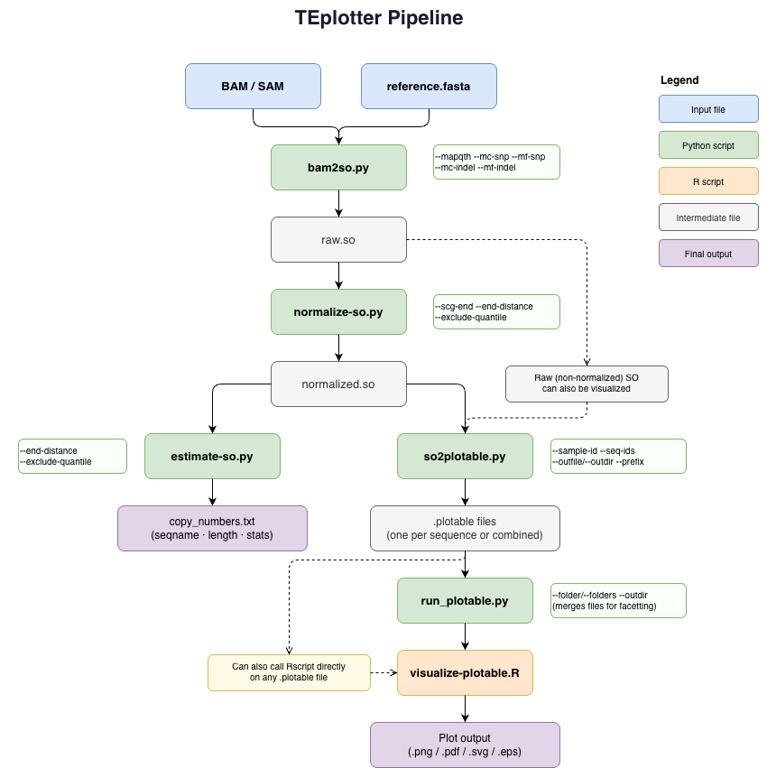

# TEplotter

A Python toolkit for converting BAM/SAM alignment files to sequence overview (SO) format, with support for variant detection (SNPs, indels), coverage normalization, and visualization-ready outputs.

## Overview

TEplotter processes short-read alignments to extract coverage, SNP, and indel information for each reference sequence. It's particularly useful for analyzing genomic regions of interest (e.g. TEs, genes, symbionts) and their coverage and variation.

### Workflow



## Features

- **BAM/SAM Processing**: Converts alignments to sequence overview (SO) format with pysam
- **Variant Detection**: Identifies SNPs and indels with configurable thresholds
- **Coverage Analysis**: Tracks read depth per position with ambiguous mapping support
- **Normalization**: Normalizes coverage using single-copy genes (SCGs) as reference
- **Copy Number Estimation**: Computes average copy number from coverage data
- **Visualization**: Generates tab-delimited output compatible with R/ggplot2
- **Batch Plotting**: Automates running the R visualization script across one or multiple sample folders

## Installation

### Requirements

- Python 3.7+
- pysam
- R + ggplot2 (for visualization)
- (Optional) samtools (for FASTA indexing)

### Quick Install

```bash
pip install pysam
```

## Usage

### 1. Convert BAM/SAM to Sequence Overview Format

```bash
python bam2so.py \
  --infile alignments.bam \
  --fasta reference.fasta \
  --mapqth 5 \
  --mc-snp 5 \
  --mf-snp 0.1 \
  --mc-indel 3 \
  --mf-indel 0.01 \
  --outfile output.so
```

**Parameters:**
- `--infile`: Input BAM or SAM file (required)
- `--fasta`: Reference FASTA file (required)
- `--mapqth`: Mapping quality threshold (default: 5) — reads below this are counted as "ambiguous"
- `--mc-snp`: Minimum SNP count (default: 5)
- `--mf-snp`: Minimum SNP frequency (default: 0.1)
- `--mc-indel`: Minimum indel count (default: 3)
- `--mf-indel`: Minimum indel frequency (default: 0.01)
- `--outfile`: Output SO file; if omitted, prints to stdout
- `--log-level`: Logging verbosity — DEBUG, INFO, WARNING, ERROR, CRITICAL (default: INFO)

### 2. Normalize Coverage by Single-Copy Genes

```bash
python normalize-so.py \
  --so input.so \
  --scg-end _scg \
  --end-distance 100 \
  --exclude-quantile 25 \
  --outfile normalized.so
```

**Parameters:**
- `--so`: Input SO file (required)
- `--scg-end`: Suffix used to identify single-copy genes (default: `_scg`)
- `--end-distance`: Number of bases to exclude from sequence ends during normalization (default: 100)
- `--exclude-quantile`: Exclude this percentage of extreme coverage values from both ends of the distribution (default: 25)
- `--outfile`: Output file; if omitted, prints to stdout
- `--log-level`: Logging verbosity (default: INFO)

### 3. Estimate Copy Number

```bash
python estimate-so.py \
  --so normalized.so \
  --end-distance 100 \
  --exclude-quantile 25 \
  --outfile copy_numbers.txt
```

Outputs tab-delimited format: `seqname <tab> length <tab> mean_coverage <tab> min_coverage <tab> max_coverage <tab> median_coverage <tab> ...`

**Parameters:**
- `--so`: Input SO file (required)
- `--end-distance`: Distance from sequence ends to exclude (default: 100)
- `--exclude-quantile`: Quantile threshold for excluding extreme coverage values (default: 25)
- `--outfile`: Output file; if omitted, prints to stdout
- `--log-level`: Logging verbosity (default: INFO)

### 4. Convert to Plotable Format

```bash
# Write all sequences to a single file
python so2plotable.py \
  --so input.so \
  --sample-id year1933 \
  --seq-ids gypsy,act_scg \
  --outfile sequences.plotable

# Write each sequence to its own file in a directory
python so2plotable.py \
  --so input.so \
  --sample-id year1933 \
  --seq-ids ALL \
  --outdir myplotables/ \
  --prefix strain1_
```

Generates visualization-ready tab-delimited output with columns: `seqname`, `sampleid`, `feature` (cov / ambcov / snp / del / ins), `position`, `value`.

**Parameters:**
- `--so`: Input SO file (required)
- `--sample-id`: Label for this sample, embedded in every output row (default: `x`)
- `--seq-ids`: Comma-separated list of sequence IDs to include, or `ALL` to include every sequence (default: `ALL`)
- `--outfile`: Write all selected sequences into a single plotable file
- `--outdir`: Write one `.plotable` file per sequence into this directory (mutually exclusive with `--outfile`)
- `--prefix`: Filename prefix applied when using `--outdir` (only valid with `--outdir`)
- `--log-level`: Logging verbosity (default: INFO)

**Notes:**
- Both normalized and non-normalized SO files can be visualized.
- Plotable files from different samples and sequences can be freely concatenated, enabling joint visualization across samples (e.g. `cat sample1/*.plotable sample2/*.plotable > combined.plotable`).

### 5. Batch Plotting with `run_plotable.py`

`run_plotable.py` automates running `visualize-plotable.R` on one or more folders of `.plotable` files.

**Single folder — plot each file independently:**
```bash
python run_plotable.py \
  --folder Dmel01_plottable \
  --outdir results/
```

**Multiple folders — merge same-named files across samples, then plot (enables facetting):**
```bash
python run_plotable.py \
  --folders Dmel01_plottable Dmel02_plottable Dmel03_plottable \
  --outdir merged_results/
```

**Parameters:**
- `--folder`: Single sample folder; each `.plotable` file is plotted independently (mutually exclusive with `--folders`)
- `--folders`: One or more sample folders; `.plotable` files with matching names are merged before plotting (mutually exclusive with `--folder`)
- `--outdir` / `-o`: Output directory for the generated plots. Required when `--folders` is used; defaults to the source folder when `--folder` is used.

When using `--folders`, files with the same name across directories are concatenated before being passed to the R script. This automatically triggers facetting in the visualization, making it easy to compare e.g. TE copy numbers across samples.

### 6. Visualize

```bash
Rscript visualize-plotable.R sequences.plotable output.png
```

Supported output extensions include `.png`, `.pdf`, `.eps`, and `.svg`. Plotable files from different samples may also be concatenated manually and passed directly to the R script to invoke facetting:

```bash
cat sample1.plotable sample2.plotable > combined.plotable
Rscript visualize-plotable.R combined.plotable output.png
```
**Note:** an important design decision was that plotable entries for different samples (e.g strains collected at different years) and sequences (e.g. TEs or SCGs) can be combined freely by the user, which allows for joint visualization

## File Formats

### Sequence Overview (SO) Format

A tab-delimited format containing:
- Coverage per position
- Ambiguous coverage (low MAPQ reads)
- SNP calls with per-base allele counts
- Indel calls (insertions/deletions) with position, length, and count

### Plotable Format

Tab-delimited format for direct plotting in R/ggplot2:
```
seqname  sampleid  feature  position  value
TE_001   sample_1  cov      1         42.5
TE_001   sample_1  snp      100       A  T  3
```

## Examples

### Complete Pipeline

```bash
# 1. Convert BAM to SO
python bam2so.py \
  --infile reads.bam \
  --fasta te_library.fasta \
  --outfile raw.so

# 2. Normalize coverage
python normalize-so.py \
  --so raw.so \
  --scg-end _scg \
  --outfile normalized.so

# 3. Estimate copy numbers
python estimate-so.py \
  --so normalized.so \
  --outfile copy_numbers.txt

# 4. Format for plotting (one file per sequence)
python so2plotable.py \
  --so normalized.so \
  --sample-id my_sample \
  --seq-ids ALL \
  --outdir my_sample_plotables/

# 5. Plot all sequences in the folder
python run_plotable.py \
  --folder my_sample_plotables/ \
  --outdir my_sample_plots/

# Or plot directly with R
Rscript visualize-plotable.R my_sample_plotables/gypsy.plotable output.png
```

### Adjusting Variant Thresholds

Stricter SNP filtering:
```bash
python bam2so.py \
  --infile reads.bam \
  --fasta te_library.fasta \
  --mc-snp 10 \
  --mf-snp 0.2 \
  --outfile output.so
```

### Comparing Multiple Samples

```bash
# Generate plotables per sample
for sample in Dmel01 Dmel02 Dmel03; do
  python so2plotable.py \
    --so ${sample}_normalized.so \
    --sample-id ${sample} \
    --seq-ids ALL \
    --outdir ${sample}_plotables/
done

# Merge and plot
python run_plotable.py \
  --folders Dmel01_plotables Dmel02_plotables Dmel03_plotables \
  --outdir merged_plots/
```

## Core Modules

### `modules.py`

Contains shared utilities:
- **SequenceEntry**: Data class for sequence overview records
- **SequenceEntryBuilder**: Accumulates reads for a sequence and extracts variants
- **SequenceEntryReader**: Iterator over SO files (supports gzip)
- **FileWriter**: Output writer (file or stdout)
- **NormFactor**: Normalization using SCG coverage
- **SNP, Indel**: Variant data classes

### `bam2so.py`

Main conversion pipeline:
1. Loads reference FASTA
2. Iterates alignments (skips unmapped, secondary, supplementary)
3. Builds per-position coverage, SNPs, and indels
4. Writes SO format output

### `normalize-so.py`

Normalizes coverage using the median coverage of SCGs across the middle of each sequence (excluding ends and extreme quantiles).

### `estimate-so.py`

Computes per-sequence coverage statistics (useful for copy number estimation when coverage has been normalized to SCGs).

### `so2plotable.py`

Transforms SO entries into a tab-delimited format suitable for visualization. Supports writing all sequences to one file or splitting into per-sequence files in an output directory.

### `run_plotable.py`

Batch runner that automates calling `visualize-plotable.R` on folders of `.plotable` files. Supports single-sample mode (independent plots) and multi-sample mode (merge matching files for facetted plots).

## Tips & Best Practices

1. **FASTA indexing**: Create a `.fai` index for faster access:
   ```bash
   samtools faidx reference.fasta
   ```

2. **BAM indexing**: Ensure BAM files are sorted and indexed:
   ```bash
   samtools sort -o sorted.bam input.bam
   samtools index sorted.bam
   ```

3. **Threshold tuning**: Adjust `--mc-snp`, `--mf-snp`, etc. based on coverage depth and expected variation rates.

4. **Single-copy genes**: If normalizing, ensure your reference includes sequences with the `_scg` suffix (or your chosen `--scg-end`); coverage is normalized to the mean coverage of these sequences.

5. **Large files**: SO format can be space-intensive. Consider gzip compression for archival:
   ```bash
   gzip output.so
   # SO files ending in .gz are read automatically
   python so2plotable.py --so output.so.gz ...
   ```

6. **Multi-sample comparison**: Use `run_plotable.py --folders` to merge plotable files across samples automatically rather than concatenating files by hand.

## Troubleshooting

### "Reference 'X' not found in FASTA"
Ensure the BAM header references sequences present in your FASTA file. Check consistency:
```bash
samtools view -H alignments.bam | head
samtools faidx reference.fasta && head reference.fasta.fai
```

### Missing FASTA index
Create an index for faster reference lookups:
```bash
samtools faidx reference.fasta
```

### pysam import errors
Install or upgrade pysam:
```bash
pip install --upgrade pysam
```

### Normalization factor is zero
This usually means no sequences with the `--scg-end` suffix were found, or their coverage is effectively zero. Verify that your reference FASTA includes properly named SCG sequences and that reads mapped to them.

## Author

Original authors: Robert Kofler, Sarah Saadain

## License

TODO

## Citation

If you use TEplotter in your research, please cite:
```
TODO
```

## Contributing

Contributions welcome! Please open an issue or submit a pull request.